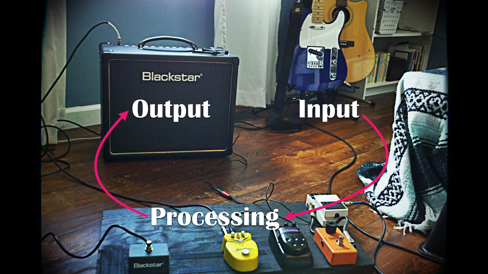
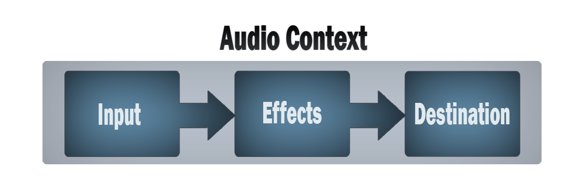
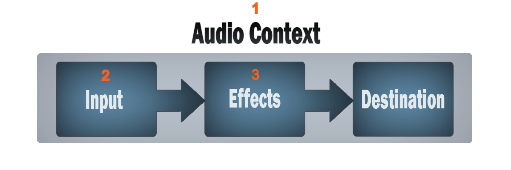
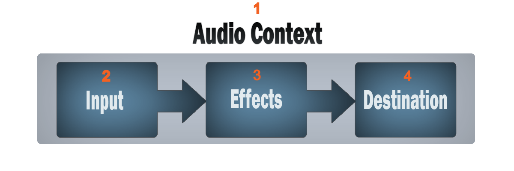
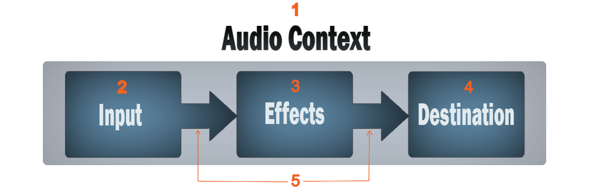
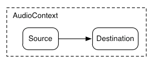
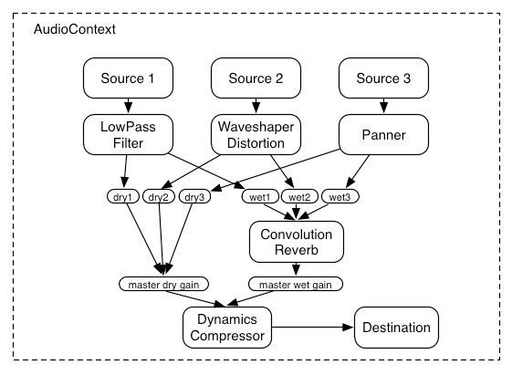
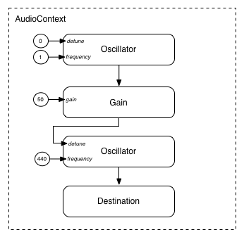

# Music Synthesis

### in JavaScript

<small>  
Sébastien Jalliffier Verne  
[github.com/volcomix](https://github.com/volcomix)
</small>

Notes:
Today I would like to give you an overview of sound synthesis, maybe music creation, and what kind of powerful things
you can do right inside your browser.

---

## What is the Web Audio API?

A high-level JavaScript API for processing and synthesizing audio in web applications

Notes:
So let me introduce the Web Audio API.
The Web Audio API is a high-level JavaScript API for processing and synthesizing audio in web applications.

---

## What can I use it for?

Notes:

- The goal of this API is to include capabilities found in modern game audio engines and
  some of the mixing, processing, and filtering tasks that are found in modern desktop audio production applications.
- You can also make audiovisual art by combining music or sounds produced with Web Audio with
  visuals made with 2D canvas graphics, 3D WebGL, or SVG.

---

## How does it work?



Notes:

At the heart of the Web Audio API is a number of different audio inputs, processors, and outputs,
which you can combine into an audio routing graph that creates the sound you need.

---

## Resources

- [Web Audio API on MDN](https://developer.mozilla.org/en-US/docs/Web/API/Web_Audio_API)
- [Synth Secrets](https://www.soundonsound.com/techniques/synth-secrets-all-63-parts-sound-on-sound)
- [AudioNodes](https://audionodes.com/online)

---

## Web Audio API

<small>See [MDN](https://developer.mozilla.org/en-US/docs/Web/API/Web_Audio_API)</small>

Audio routing graph

Audio nodes  
<small>See [MDN](https://developer.mozilla.org/en-US/docs/Web/API/AudioNode#Description)</small>

Audio params

Scheduling

---

## Concepts

- Audio context  
  <small class="fragment" data-fragment-index="1">➔ is the place where audio is operated</small>
- Audio nodes  
  <small class="fragment" data-fragment-index="2">➔ are basic elements of audio</small>
- Modular routing  
  <small class="fragment" data-fragment-index="3">➔ connects nodes with each other</small>
- Audio routing graph  
  <small class="fragment" data-fragment-index="4">➔ the network of audio nodes</small>

---

## Typical workflow

<!-- .slide: data-transition="none" -->



¨¨¨

## Typical workflow

<!-- .slide: data-transition="none" -->


¨¨¨

## Typical workflow

<!-- .slide: data-transition="none" -->


¨¨¨

## Typical workflow

<!-- .slide: data-transition="none" -->



¨¨¨

## Typical workflow

<!-- .slide: data-transition="none" -->



¨¨¨

## Typical workflow

<!-- .slide: data-transition="none" -->



---

## General audio graph definition

- AudioContext
- AudioNode
- AudioParam

---

## Defining audio sources

- OscillatorNode
- AudioBuffer
- AudioBufferSourceNode
- MediaElementAudioSourceNode
- MediaStreamAudioSourceNode

---

## Defining audio effects filters

- BiquadFilterNode
- ConvolverNode
- DelayNode
- DynamicsCompressorNode
- GainNode
- WaveShaperNode
- PeriodicWave
- IIRFilterNode

---

## Defining audio destinations

- AudioDestinationNode
- MediaStreamAudioDestinationNode

---

## Data analysis and visualization

- AnalyserNode

---

## Splitting and merging audio channels

- ChannelSplitterNode
- ChannelMergerNode

---

## Audio spatialization

- PannerNode
- StereoPannerNode

---

## Audio processing in JavaScript

TBD

---

Simple example of modular routing



```js
const context = new AudioContext()

function playSound() {
  const source = context.createBufferSource()
  source.buffer = dogBarkingBuffer
  source.connect(context.destination)
  source.start(0)
}
```

---

More complex example of modular routing



---

Modular routing with one oscillator modulating the frequency of another



---

```js
function setupRoutingGraph() {
  const context = new AudioContext()
  // Create the low frequency oscillator that supplies the modulation signal
  const lfo = context.createOscillator()
  lfo.frequency.value = 1.0
  // Create the high frequency oscillator to be modulated
  const hfo = context.createOscillator()
  hfo.frequency.value = 440.0
  // Create a gain node whose gain determines the amplitude of the modulation signal
  const modulationGain = context.createGain()
  modulationGain.gain.value = 50
  // Configure the graph and start the oscillators
  lfo.connect(modulationGain)
  modulationGain.connect(hfo.detune)
  hfo.connect(context.destination)
  hfo.start(0)
  lfo.start(0)
}
```

---

## SYNTHESIS BASICS

Oscillator  
<small>Frequency</small>

Gain  
<small>Amplitude</small>

Biquad filter  
<small>Lowpass, highpass, bandpass, ...</small>

Envelope

Frequency Modulation

LFO
