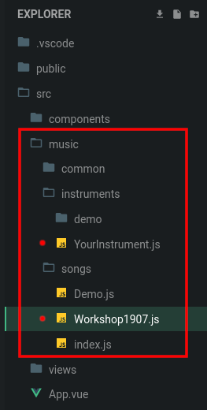

<!-- .slide: class="title" data-background-color="#2a2e33" data-background-image="assets/mixer-background.jpg" data-background-opacity="0.3" -->

# Music Synthesis

### in JavaScript

<small>  
Sébastien Jalliffier Verne  
https://github.com/volcomix/music-synthesis-js
</small>

---

## What is the Web Audio API?

 <!-- .element: width="40%" -->

A high-level JavaScript API for processing and synthesizing audio

---

## What can I use it for?

 <!-- .element: width="40%" style="margin: 0" -->
 <!-- .element: class="plain" width="40%" style="margin: 0" -->
 <!-- .element: class="plain" width="40%" style="margin: 0" -->

---

## Where can I use it?


---

## How does it work?

 <!-- .element: class="plain" -->

---

<!-- .slide: data-background-color="#2a2e33" -->

## Workshop

https://codesandbox.io/s/github/volcomix/coder-synth

---

Your code goes here



---

You need an AudioContext and a destination

```js
const audioContext = new AudioContext()
const destination = audioContext.destination
```

 <!-- .element: class="plain fragment" data-fragment-index="1" width="60%" -->

---

Adding a track for your instrument

```js
// src/music/songs/Workshop1907.js

import Song from '../common/Song'
import Oscillator from '../instruments/demo/Oscillator'

export default class Workshop1907 extends Song {
  tempo = 140
  notesPerBeat = 2
  tracks = {
    Oscillator: {
      instrument: new Oscillator(this.audioContext, this.destination),
    },
  }
}
```

---

## Let's make some noise!

 <!-- .element: class="plain" width="90%" -->

---

## Oscillator

 <!-- .element: width="90%" style="margin: -18% 0" class="plain" -->

```js
// src/music/instruments/Oscillator.js

import Instrument from '../../common/Instrument'

export default class Oscillator extends Instrument {
  start() {
    this.oscillator = this.audioContext.createOscillator()
    this.oscillator.type = 'sine' // Or square, triangle, sawtooth, custom
    this.oscillator.frequency.value = 440
    this.oscillator.connect(this.destination)
    this.oscillator.start()
  }

  stop() {
    this.oscillator.stop()
  }
}
```

---

<!-- .slide: data-background-iframe="https://volcomix.github.io/coder-synth/Demo/Oscillator" data-background-interactive -->

---

Playing some notes

```js
// src/music/songs/Workshop1907.js

Notes: {
  instrument: new Oscillator(this.audioContext, this.destination),
  notes: `
    C-4 --- E-4 --- F#4 --- G-4 ---
    --- --- --- --- --- --- --- OFF
  `,
}

// src/music/instruments/Oscillator.js

export default class Oscillator extends Instrument {
  ...

  noteOn(noteFrequency, time) {
    this.oscillator.frequency.setValueAtTime(noteFrequency, time)
  }

  noteOff(time) {
    this.oscillator.frequency.setValueAtTime(0, time)
  }
}
```

---

<!-- .slide: data-background-iframe="https://volcomix.github.io/coder-synth/Demo/Notes" data-background-interactive -->

---

## Amplitude

 <!-- .element: style="margin: -15% 0" class="plain" -->

```js
start() {
  this.oscillator = this.audioContext.createOscillator()

  this.gain = this.audioContext.createGain()
  this.gain.gain.value = 0.5

  this.oscillator.connect(this.gain)
  this.gain.connect(this.destination)

  this.oscillator.start()
}
```

---

<!-- .slide: data-background-iframe="https://volcomix.github.io/coder-synth/Demo/Amplitude" data-background-interactive -->

---

Scheduling some effects

<pre><code class="js" data-line-numbers="1,9-14,17-21">// src/music/songs/Workshop1907.js

Effects: {
  instrument: new Amplitude(this.audioContext, this.destination),
  notes: `
    C-4 --- E-4 --- F#4 --- G-4 ---
    --- --- --- --- --- --- --- OFF
  `,
  effects: {
    gain: `
    056 --- --- --- --- --- 255 ---
    --- --- --- --- --- --- --- 000
    `,
  },
}

// src/music/instruments/Amplitude.js

fxGain(gain, time) {
  this.gain.gain.linearRampToValueAtTime(gain / 255, time)
}
</code></pre>

---

<!-- .slide: data-background-iframe="https://volcomix.github.io/coder-synth/Demo/Effects" data-background-interactive -->

---

## Envelope

 <!-- .element: class="plain" -->

---

```js
noteOn(noteFrequency, time) {
  this.oscillator.frequency.setValueAtTime(noteFrequency, time)

  // Attack
  this.gain.gain.setValueAtTime(0, time)
  this.gain.gain.linearRampToValueAtTime(1, time + 0.2)

  // Decay
  this.gain.gain.linearRampToValueAtTime(0.5, time + 0.4)
}

// Sustain

noteOff(time) {
  // Release
  this.gain.gain.setValueAtTime(0.5, time)
  this.gain.gain.linearRampToValueAtTime(0, time + 0.5)
}
```

---

<!-- .slide: data-background-iframe="https://volcomix.github.io/coder-synth/Demo/Envelope" data-background-interactive -->

---

## Low-frequency oscillator (LFO)

 <!-- .element: class="plain" width="50%" -->

---

```js
start() {
  this.lfo = this.audioContext.createOscillator()
  this.lfo.frequency.value = 1

  this.oscillator = this.audioContext.createOscillator()
  this.oscillator.frequency.value = 440

  this.modulationGain = this.audioContext.createGain()
  this.modulationGain.gain.value = 50

  this.lfo.connect(this.modulationGain)
  this.modulationGain.connect(this.oscillator.detune)
  this.oscillator.connect(this.destination)

  this.lfo.start()
  this.oscillator.start()
}

stop() {
  this.lfo.stop()
  this.oscillator.stop()
}
```

---

<!-- .slide: data-background-iframe="https://volcomix.github.io/coder-synth/Demo/LFO" data-background-interactive -->

---

## Frequency Modulation (FM)

 <!-- .element: class="plain" width="50%" -->

---

```js
start() {
  this.oscillator1 = this.audioContext.createOscillator()
  this.oscillator1.frequency.value = 220

  this.oscillator2 = this.audioContext.createOscillator()
  this.oscillator2.frequency.value = 440

  this.modulationGain = this.audioContext.createGain()
  this.modulationGain.gain.value = 50

  this.oscillator1.connect(this.modulationGain)
  this.modulationGain.connect(this.oscillator2.frequency)
  this.oscillator2.connect(this.destination)

  this.oscillator1.start()
  this.oscillator2.start()
}

stop() {
  this.oscillator1.stop()
  this.oscillator2.stop()
}
```

---

<!-- .slide: data-background-iframe="https://volcomix.github.io/coder-synth/Demo/FM" data-background-interactive -->

---

## Additive synthesis

 <!-- .element: style="margin-top: -5%" class="plain" -->

---

```js
start() {
  this.oscillator1 = this.audioContext.createOscillator()
  this.oscillator1.frequency.value = 220

  this.oscillator2 = this.audioContext.createOscillator()
  this.oscillator2.frequency.value = 440

  this.gain1 = this.audioContext.createGain()
  this.gain1.gain.value = 0.5

  this.gain2 = this.audioContext.createGain()
  this.gain2.gain.value = 0.5

  this.oscillator1.connect(this.gain1)
  this.oscillator2.connect(this.gain2)
  this.gain1.connect(this.destination)
  this.gain2.connect(this.destination)

  this.oscillator1.start()
  this.oscillator2.start()
}

stop() {
  this.oscillator1.stop()
  this.oscillator2.stop()
}
```

---

<!-- .slide: data-background-iframe="https://volcomix.github.io/coder-synth/Demo/Additive" data-background-interactive -->

---

[TBD] Filters

---

<!-- .slide: class="title" data-background-color="#2a2e33" data-background-image="assets/strings.jpg" data-background-opacity="0.3" -->

# Example

---

<!-- .slide: data-background-iframe="https://volcomix.github.io/coder-synth/Demo/Example" data-background-interactive -->

---

## Resources

<small>https://developer.mozilla.org/en-US/docs/Web/API/Web_Audio_API</small>  
<small>https://www.soundonsound.com/techniques/synth-secrets-all-63-parts-sound-on-sound</small>  
<small>https://learningsynths.ableton.com</small>  
<small>https://audionodes.com/online</small>
